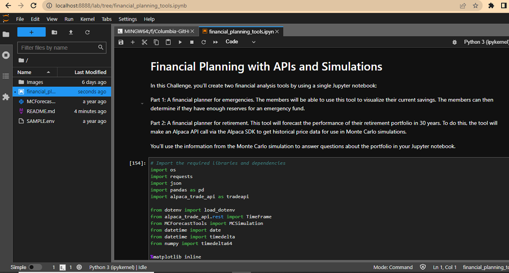

# Financial Planner

Financial Planner is a prototype application to analyze the individual's portfolio perfomance as well as retirement portfolio. The portfolio of a fictious Credit Union Members are taken for analysis.

The prototype has two parts.

Part 1: A financial planner for emergencies. The members will be able to use this tool to visualize their current savings. The members can then determine if they have enough reserves for an emergency fund.

Part 2: A financial planner for retirement. This tool will forecast the performance of their retirement portfolio in 30 & 10 years. To do this, the tool will make an Alpaca API call via the Alpaca SDK to get historical price data for use in Monte Carlo simulations.

---

## Technologies

This project leverages python 3.7.* with the following additional packages:
* [Jupyter Notebook](https://jupyter.org/) - The main module of the Financial Planner is written in Jupyter Notebook.
* [Conda](https://docs.conda.io/projects/conda/en/latest/) - Conda environment is recommended to have Pandas library and other dependencies pre-installed.

**Required Framework:**

- [Alpaca SDK](https://alpaca.markets/docs/trading/getting-started/) - Alpaca is a technology company that is dedicated to building a stock trading API. You may need to sign up in Alpaca to generate API key and Secret key to access Alpaca APIs via SDK.

**Required Libraries:**

You may need the following libraries to work with the program.

- [Pandas](https://pandas.pydata.org/docs/reference/index.html) - pandas is a Python package providing fast, flexible, and expressive data structures designed to make working with “relational” or “labeled” data both easy and intuitive.
- [NumPy](https://numpy.org/doc/stable/user/absolute_beginners.html) - NumPy is the fundamental package for scientific computing in Python.
- [python-dotenv](https://pypi.org/project/python-dotenv/) - Python-dotenv reads key-value pairs from a .env file and can set them as environment variables.

---

## Usage

To use the Financial Planner prototype application, clone the repository and run the **financial_planning_tools.ipynb** with Jupyter notebook.

From the Git Bash terminal, make sure to 'activate conda' and appropriate virtual enivorment. Next, launch the JupyterLab web-based interactive development environment (IDE) interface by typing at the prompt:

```python
  > jupyter lab
```

Then, browse to **financial_planning_tools.ipynb** starter code file to run the program. See the image below for a quick hint.



**Note:** The Alpaca API keys are stored in a separate hidden environment (.env) file. When you run **financial_planning_tools.ipynb** in the Jupyter Notebook, make sure to have a .env file in a format **SAMPLE.env** contained in the project folder itself.

## Contributors

FinTech Labs, Inc.

---

## License

None